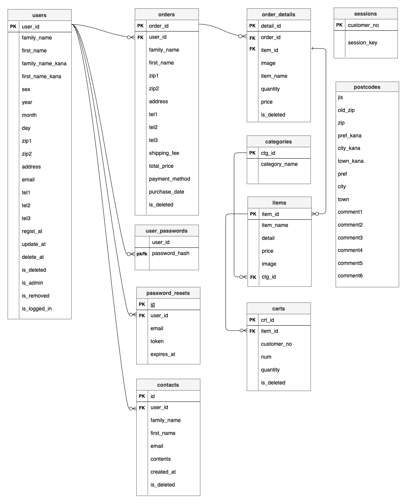

# DT-Health


## カテゴリー

## マイアカウント

## ログイン 会員登録


## 概要
野菜果物中心の商品と商品の季節や栄養素を簡単に閲覧・購入できるECサイトです。

(レスポンシブ対応済み)

## 制作した理由 
コロナに罹った後、健康的な食事を意識するようになったことがきっかけで制作しました。

ECサイトとしても利用できますが、私は主に季節の野菜や果物を調べ、スーパーで安く買うために使っています。

## 使用技術
- フロントエンド
  - Twig: 2.0 
  - Bootstrap: 5.3.0
  - css
  - Javascript
  - JQuery: 3.6.0
- バックエンド
  - PHP: 8.2.11
- その他
  - Docker: 27.2.0 Docker Compose
  - MYSQL: 5.7.39
  - MAMP または XAMPP
  - Visual Studio Code
  - draw.io


## 主な機能
- 商品一覧
  - カテゴリーごとに商品を閲覧
  - カート内のアイテム数量を表示
  - カートへのアイテムを追加して数量変更
  - ユーザー情報とアイテム情報を確認して購入手続きを行う。
- マイアカウント
  - プロフィール情報の閲覧と更新。
  - 購入履歴の確認、再購入
  - 購入履歴詳細
  - お問い合わせ。

- 管理者権限のある管理ページ
  - お客様情報
  - 注文履歴詳細
  - お問い合わせ

- 認証
  - 新規登録とログイン
  - 管理者権限ログイン
- その他: 
  - パーソナライズされたユーザー挨拶
  - 商品検索
  - ソート : 安い値段、高い値段、アルファベット順
  - パスワードリセット
  - 退会

## ディレクトリー構成
```
DTMarket

├── README.md
├── composer.json
├── composer.lock
├── css
│   └── list.css
├── docker
│   ├── apache-config
│   │   └── 000-default.conf
│   ├── db
│   │   ├── DTshopping.sql
│   │   └── my.cnf
│   ├── docker-compose.yml
│   ├── php
│   │   └── Dockerfile
│   └── .env
├── index.php
├── js
│   └── shopping.js
├── mysql
│   └── DTshopping_sql
├── shopping
│   ├── admin
│   │   └── admin_login.php
│   ├── auth
│   │   └── login.php
│   ├── images
│   │   └── pumpkin.jpg
│   ├── lib
│   │   └── PDODatabase.class.php
│   ├── order
│   │   └── list.php
│   └── Bootstrap.class.php
├── templates
│   └── shopping
│       └── list.html.twig
└── vendor
    ├── autoload.php
    ├── bin
    ├── composer
    ├── symfony
    └── twig

```
# 環境構築

## Composerのインストール
### 1. Composerを使用して、必要なPHPパッケージをインストールします

```
composer install
```
**補足:** composer installを実行すると、composer.jsonファイルに基づいて必要なライブラリがインストールされ、composer.lockファイルが自動的に生成されます。

#### 2. Twigのバージョン指定

composer.json内でTwigのバージョンを明記します。(今回はバージョン2.0を使用しています。)

```json
{
  "require": {
    "twig/twig": "^2.0"
  }
}
```
この設定を行った後、以下のコマンドを再度実行することで、指定したバージョンがインストールされます。

```bash
composer update
```


## Bootstrap.class.phpの設定

Bootstrap.class.phpでDocker環境とローカル環境の両方に対応する設定を変更します。

**注意** :  Docker環境とローカル環境では、データベースの`database_name`と`username`と`password`をBootstrap.class.phpの`database_name`と`username`と`password`は同じにしなければいけません。

今回はデフォルトで書いてありますが、環境に合わせて自由に編集してください。
```php
//（Docker/ローカル共通設定）
const DB_NAME = 'your_database_name';  // 例: 'DTshopping_db'
const DB_USER = 'your_username';       // 例: 'DTshopping_user'
const DB_PASS = 'your_password';       // 例: 'DTshopping_pass'
const DB_TYPE = 'mysql';
```
また使用する環境に応じて、**コメントアウト**で切り替えてください。


```php
// Docker環境
const DB_HOST = 'db'; 
const APP_DIR = '/var/www/html/'; 
const APP_URL = 'http://localhost:8888/';
```

```php
// ローカル環境
const DB_HOST = 'localhost';
const APP_DIR = '/Applications/MAMP/htdocs/DTMarket/';
const APP_URL = 'http://localhost/DTMarket/';
```

## index.phpの設定
今回は、indexを使わなかったので、index.phpからlist.phpへリダイレクトします。Docker環境とローカル環境の両方に対応しています。

また使用する環境に応じて、**コメントアウト**で切り替えてください。
### Docker環境
```php
header("Location: ../shopping/order/list.php");
exit();
```
### ローカル環境
```php
header('Location:' . Bootstrap::ENTRY_URL . 'order/list.php');
exit();
```

## githubからプロジェクトをクローン

```bash
git clone https://github.com/nasupi3156/DTMarket.git
```

### プロジェクトのルートディレクトリーに移動

```bash
cd /path/to/DTMarket
``` 

## Dockerの環境構築

### 0. Docker環境をインストール

```diff
Docker環境を利用するには、公式サイトからインストールしてください。

詳細なインストール手順については、各公式サイトを参考にしてください。
```

### 1. プロジェクトのルートディレクトリーに移動
```bash
cd /path/to/docker
```

### 2. .envファイルの作成
.envファイルは、dockerフォルダの下に作成してください。

.envファイルは、デフォルトで作成してありますが`database_name`と`username`と`password`など環境に合わせて自由に編集してください。

```bash
WEB_PORT=8888
MYSQL_ROOT_PASSWORD=DTshopping_root   
MYSQL_DATABASE=DTshopping_db       
MYSQL_USER=DTshopping_user            
MYSQL_PASSWORD=DTshopping_pass        

```
### 3. Dockerイメージの作成・更新

```bash
docker compose build
```
### 4. コンテナを起動

```bash
docker compose up -d
```
### 5. ビルドと再起動を同時にする場合

```bash
docker compose up --build -d
```
### 6. コンテナが起動したら

ブラウザで以下のURLにアクセスしてください：

```bash
http://localhost:8888  # ここでのポート番号は.envファイルに設定したものを使用します
```
### 7. コンテナの停止

```bash
docker compose down
```

###  データベースをリセットしてコンテナを停止する場合は、次のコマンドを使用してください

```bash
docker compose down -v
```

###  コンテナの起動や実行中にエラーが発生した場合は、次のコマンドを使用してください
また必要に応じてエラーの調査を行なってください
```bash
docker compose logs
```

## ローカルの環境構築


### 0. MAMP または XAMPP をインストール

```diff
ローカル環境でデータベースを利用するには、MAMP（Mac）やXAMPP（Windows）などの開発環境をインストールしてください。

詳細なインストール手順については、各公式サイトを参考にしてください。
```

### 1. MySQLの`bin`ディレクトリに移動します。


**MAMPを使用する場合 (Mac)**

```bash
$ cd /Applications/MAMP/Library/bin
```
**XAMPPを使用する場合 (Windows)**
```bash
$ cd C:\xampp\mysql\bin
```

#### 2. 次に、MySQLにrootユーザーで接続します。

```bash
$ ./mysql -u root -p
```

#### 3. 接続できたら、下記のコードを順番にコピーして貼り付けてください。

**注意：** デフォルトで作成してありますが`database_name`と`username`と`password`など環境に合わせて自由に変更してください。

```sql
CREATE DATABASE DTshopping_db DEFAULT CHARACTER SET utf8mb4 COLLATE utf8mb4_unicode_ci;	
```

```sql
GRANT ALL PRIVILEGES ON DTshopping_db.* TO DTshopping_user@'localhost' IDENTIFIED BY 'DTshopping_pass' WITH GRANT OPTION;	
```
#### 4. データベースに接続します。

```sql
USE DTshopping_db;
```

#### 5. テーブル情報をデータベースに接続します。

mysqlフォルダー内の`DTshopping.sql`にあるテーブルやインサート情報を順番にインポートしてください。

**注意：**  一度に沢山をインポートするとエラーが起きる可能性が高いので、一つずつテーブルやインサートをインポートするのがオススメです。

```sql
CREATE TABLE users (
  user_id INT UNSIGNED NOT NULL AUTO_INCREMENT,
  family_name VARCHAR(20) NOT NULL,
  ...
  PRIMARY KEY (user_id)
) CHARACTER SET utf8mb4 COLLATE utf8mb4_unicode_ci;

CREATE TABLE user_passwords (
  user_id INT UNSIGNED NOT NULL,
  password_hash VARCHAR(255) NOT NULL,
  ...
) CHARACTER SET utf8mb4 COLLATE utf8mb4_unicode_ci;
...
```


## 工夫した点
シンプルで見やすいデザインを心がけ、ユーザーが使いやすい機能を充実させることに注力しました。

モバイル、タブレット、PCなど、どのデバイスからでも閲覧できるように、レスポンシブ対応しています。ただ、画面が小さくなるにつれ、デザインのバランスがイモくさく感じるかもしれません。

## 改善点
今回は、デプロイを行う事ができませんでしたが、次回は、Laravelフレームワークを使用し、AWSでデプロイを行いたいと思っています。

開発中にエラーの解決に3日から1週間以上かかることがありました。今後は、効率的な検索方法やドキュメントの活用を試行錯誤し、問題解決のスピードを向上させたいと思っています。

## ER図




